# 🤖 8-Puzzle Solver using AI Algorithms

---

## 🎯 1. Mục tiêu

Xây dựng một công cụ mô phỏng giải bài toán 8 ô chữ (8-Puzzle) bằng các thuật toán Trí tuệ nhân tạo (AI).  
Mục tiêu chính:

- Củng cố kiến thức về các thuật toán tìm kiếm trong AI.
- So sánh trực quan hiệu suất và hành vi của từng thuật toán trên cùng một bài toán.
- Phát triển giao diện trực quan giúp người dùng dễ dàng quan sát các bước giải.

---

## 📚 2. Nội dung

### 2.1. Các thuật toán Tìm kiếm không có thông tin

#### 🔹 Các thành phần chính của bài toán tìm kiếm:

- **State (Trạng thái):** Dãy ký tự độ dài 9 biểu diễn vị trí các ô (0 là ô trống).
- **Initial State:** Trạng thái bắt đầu do người dùng nhập.
- **Goal State:** Trạng thái đích (mặc định là `123456780`).
- **Actions:** Di chuyển ô trống lên, xuống, trái, phải.
- **Transition Model:** Kết quả của hành động tác động lên trạng thái hiện tại.
- **Goal Test:** Trạng thái hiện tại khớp với trạng thái đích.
- **Path Cost:** Tổng số bước đã thực hiện (UCS có thể tính thêm chi phí).

#### 🔹 Các thuật toán đã triển khai:

- **Breadth-First Search (BFS)**
- **Depth-First Search (DFS)**
- **Uniform Cost Search (UCS)**
- **Iterative Deepening Search (IDS)**

#### 🔹 Hình ảnh gif từng thuật toán

| Thuật toán | Gif minh họa        |
| ---------- | ------------------- |
| BFS        |  |
| DFS        |  |
| UCS        |  |
| IDS        |  |

#### 🔹 So sánh hiệu suất:

| Thuật toán | Nodes Expanded | Search Depth | Time (sec) |
| ---------- | -------------- | ------------ | ---------- |
| BFS        | 85             | 6            | 10.26      |
| DFS        | 235            | 30           | 23.63      |
| UCS        | 63             | 6            | 10.21      |
| IDS        | 120            | 6            | 12.30      |

#### 🔹 Nhận xét:

- **BFS** đảm bảo tìm ra lời giải tối ưu nhưng tiêu tốn bộ nhớ nhiều hơn.
- **DFS** có tốc độ nhanh nhưng dễ bị kẹt ở nhánh sai, không đảm bảo tối ưu.
- **UCS** tương tự BFS nhưng sử dụng chi phí thực tế → phù hợp khi mỗi bước có trọng số.
- **IDS** là sự kết hợp của DFS và BFS, hiệu quả ở mức trung bình nhưng tránh được nhược điểm của DFS.

---

### 2.2. Các thuật toán Tìm kiếm có thông tin

#### ✅ Thành phần bổ sung:

- **Hàm heuristic (ước lượng):** Đánh giá chi phí từ trạng thái hiện tại đến goal.
  - Heuristic dùng: `Misplaced Tiles`, `Manhattan Distance`.

#### 🧠 Thuật toán đã hoàn thành:

| Thuật toán | Gif minh họa            |
| ---------- | ----------------------- |
| Greedy     | 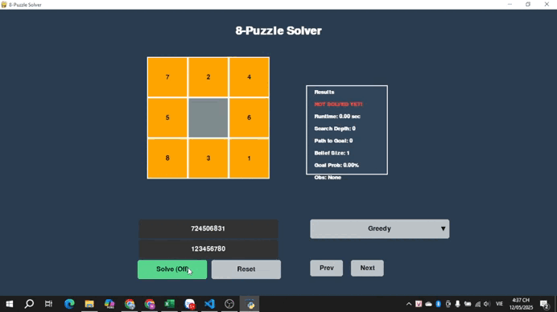  |
| A\*        |    |
| IDA\*       | 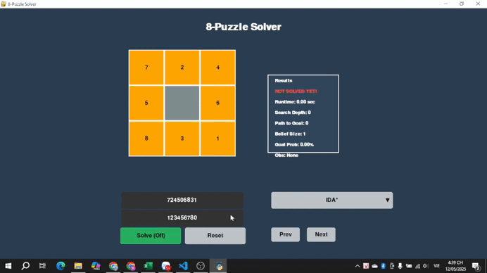 |

#### 📊 So sánh hiệu suất:

| Thuật toán | Nodes Expanded | Depth | Time (s) |
| ---------- | -------------- | ----- | -------- |
| Greedy     | 300            | 22    | 24.62    |
| A\*        | 400            | 16    | 10.20    |
| IDA\*      | 600            | 16    | 10.20    |

#### 📝 Nhận xét:

- A\* thường tìm được lời giải tối ưu và nhanh hơn UCS.
- Greedy nhanh nhưng không đảm bảo tối ưu.
- IDA* là sự kết hợp giữa DFS và A*, tiết kiệm bộ nhớ nhưng chậm hơn A\*.

---

### 2.3. Các thuật toán Tìm kiếm cục bộ

#### 🔹 Các thành phần chính của bài toán tìm kiếm:

- **State (Trạng thái):** Dãy ký tự độ dài 9 biểu diễn vị trí các ô (0 là ô trống).
- **Initial State:** Trạng thái bắt đầu do người dùng nhập hoặc random.
- **Goal State:** Trạng thái đích (mặc định là `123456780`).
- **Actions:** Di chuyển ô trống lên, xuống, trái, phải.
- **Transition Model:** Kết quả của hành động tác động lên trạng thái hiện tại.
- **Goal Test:** Trạng thái hiện tại khớp với trạng thái đích.
- **Path Cost:** Tính theo số bước di chuyển, nhưng không đảm bảo tối ưu.

#### 🔹 Các thuật toán đã triển khai:

- **Simple Hill Climbing**
- **Steepest-Ascent Hill Climbing**
- **Stochastic Hill Climbing**
- **Simulated Annealing**
- **Beam Search**
- **Genetic Algorithm**

#### 🔹 Hình ảnh gif từng thuật toán

| Thuật toán           | Gif minh họa                        |
| -------------------- | ----------------------------------- |
| Simple Hill Climbing | 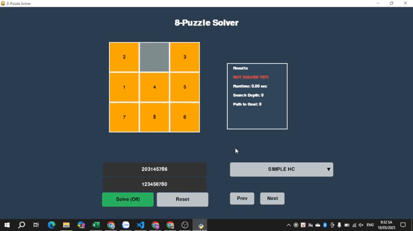           |
| Steepest-Ascent HC   |          |
| Stochastic HC        | 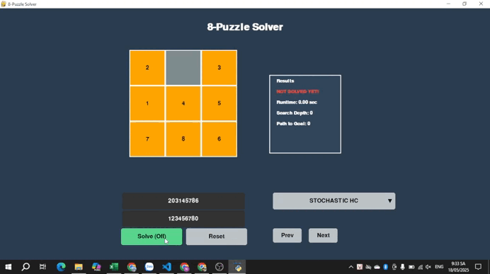       |
| Simulated Annealing  | 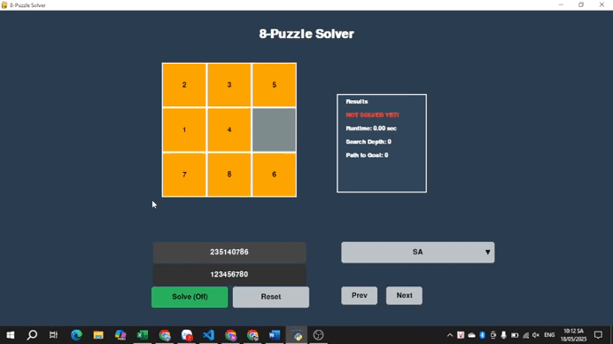 |
| Beam Search          | 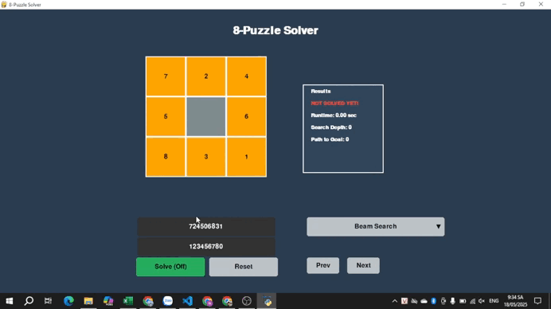         |
| Genetic Algorithm    | 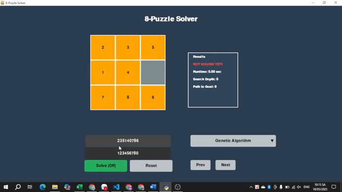  |

#### 🔹 So sánh hiệu suất:

| Thuật toán          | Nodes Expanded | Search Depth | Time (sec) |
| ------------------- | -------------- | ------------ | ---------- |
| Simple HC           | 40             | 8            | 2.55       |
| Steepest HC         | 60             | 9            | 2.52       |
| Stochastic HC       | 75             | 10           | 2.55       |
| Simulated Annealing | 120            | 11           | 3.59       |
| Beam Search         | 90             | 8            | 50.89      |
| Genetic Algorithm   | 200            | 12           | 15.34      |

#### 🔹 Nhận xét:

- **Simple HC** nhanh nhưng dễ kẹt tại local maximum, không thoát ra được.
- **Steepest HC** hiệu quả hơn Simple HC bằng cách chọn nước đi tốt nhất, nhưng vẫn có thể bị kẹt.
- **Stochastic HC** giảm xác suất kẹt bằng cách chọn ngẫu nhiên, dễ đi được xa hơn.
- **Simulated Annealing** nổi bật với khả năng "nhảy khỏi bẫy" nhờ cơ chế làm nguội – tuy nhiên không đảm bảo giải được tất cả các trạng thái.
- **Beam Search** sử dụng nhiều "tia sáng" (đường đi song song) để tăng cơ hội thoát bẫy, nhưng phụ thuộc vào beam width.
- **Genetic Algorithm** mô phỏng quá trình tiến hóa tự nhiên, hiệu quả trong tìm lời giải gần đúng nhưng cần tinh chỉnh tham số như mutation/crossover rate.

---

### 2.4. Các thuật toán Học cải thiện

#### 🔹 Các thành phần chính của bài toán tìm kiếm:

- **State (Trạng thái):** Dãy ký tự độ dài 9 biểu diễn vị trí các ô (0 là ô trống).
- **Initial State:** Trạng thái bắt đầu do người dùng nhập hoặc random.
- **Goal State:** Trạng thái đích (mặc định là `123456780`).
- **Actions:** Di chuyển ô trống lên, xuống, trái, phải.
- **Transition Model:** Kết quả của hành động tác động lên trạng thái hiện tại.
- **Goal Test:** Trạng thái hiện tại khớp với trạng thái đích.
- **Path Cost:** Số bước đã thực hiện từ trạng thái bắt đầu đến đích.

#### 🔹 Thuật toán đã triển khai:

- **Q-Learning**

#### 🔹 Hình ảnh gif thuật toán:

| Thuật toán | Gif minh họa               |
| ---------- | -------------------------- |
| Q-Learning | 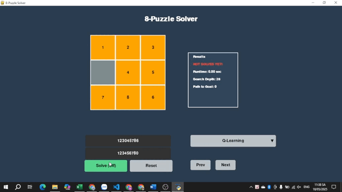 |

#### 🔹 So sánh hiệu suất:

| Thuật toán | Nodes Expanded | Search Depth | Time (sec) |
| ---------- | -------------- | ------------ | ---------- |
| Q-Learning |                |              |            |

#### 🔹 Nhận xét:

- **Q-Learning** là thuật toán học tăng cường không yêu cầu mô hình môi trường, nó học thông qua trải nghiệm lặp lại để ước lượng giá trị của hành động trong từng trạng thái.
- Do 8-puzzle là bài toán có không gian trạng thái lớn nhưng không có vòng lặp trạng thái rõ ràng, **Q-learning hoạt động như một mô phỏng học thử nhiều lần** (hơn 1000 episode).
- Tuy không đảm bảo tìm được lời giải tối ưu, **Q-Learning vẫn tìm được lời giải khả thi** sau khi được huấn luyện trên nhiều lượt thử, và biểu diễn rõ trên giao diện từng bước di chuyển từ start đến goal.
- Mô phỏng thuật toán trên giao diện hiển thị từng bước di chuyển của agent sau khi đã học xong.

---

### 2.5. Tìm kiếm trong môi trường không xác định

#### 🔹 Các thành phần chính của bài toán tìm kiếm:

- **State (Trạng thái):** Tập hợp các trạng thái có thể xảy ra (belief state), vì agent không chắc chắn đang ở trạng thái nào cụ thể.
- **Initial State:** Một tập hợp các trạng thái có thể (ví dụ: `{s1, s2, s3}`).
- **Goal State:** Một trạng thái duy nhất mà agent muốn đạt đến (mặc định là `123456780`).
- **Actions:** Di chuyển ô trống theo 4 hướng: lên, xuống, trái, phải.
- **Transition Model:** Hành động tác động lên tất cả các trạng thái trong belief state và tạo ra belief state mới.
- **Goal Test:** Belief state chỉ còn lại một trạng thái duy nhất, và đó chính là goal.
- **Path Cost:** Số bước thực hiện từ belief ban đầu đến khi tìm ra goal.

#### 🔹 Các thuật toán đã triển khai:

- **Belief State Search**
- **Searching with Partial Observation**
- **And-OR search**

#### 🔹 Hình ảnh gif từng thuật toán

| Thuật toán          | Gif minh họa           |
| ------------------- | ---------------------- |
| Belief State Search | 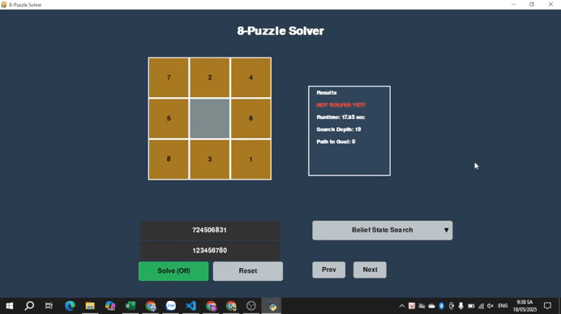 |

#### 🔹 So sánh hiệu suất:

| Thuật toán          | Nodes Expanded | Search Depth | Time (sec) |
| ------------------- | -------------- | ------------ | ---------- |
| Belief State Search |                |              |            |

#### 🔹 Nhận xét:

- **Belief State Search** là cách tiếp cận tổng quát, xử lý mọi trạng thái không chắc chắn nhưng khá tốn bộ nhớ và thời gian.
- **Partial Observation Search** tận dụng thông tin biết trước một phần trạng thái đích để loại trừ sớm những nhánh không phù hợp, giúp tìm nhanh hơn và hiệu quả hơn.
- **And-Or Search** phù hợp với môi trường không xác định và không đầy đủ thông tin, giúp agent có kế hoạch linh hoạt theo từng trường hợp. Tuy nhiên, thuật toán này phức tạp hơn trong triển khai và có thể tốn tài nguyên với không gian lớn.
- Giao diện trực quan được tách riêng giúp người dùng dễ theo dõi từng bước thay đổi của belief state theo thời gian.
- Các thuật toán này phù hợp với môi trường agent không thể xác định chính xác trạng thái ban đầu và cần ra quyết định dựa trên tập hợp các khả năng.

---

### 2.6. Các thuật toán Tìm kiếm có ràng buộc (CSP - Constraint Satisfaction Problems)

#### 🔹 Các thành phần chính của bài toán tìm kiếm:

- **Variable (Biến):** Các ô trong ma trận 3x3 tương ứng với 9 vị trí cần điền từ 1 đến 8 và một ô trống (0).
- **Domain:** Tập giá trị hợp lệ mỗi biến có thể nhận, ban đầu là `{0,1,2,3,4,5,6,7,8}`.
- **Constraints (Ràng buộc):**
  - Mỗi giá trị chỉ xuất hiện đúng một lần trong toàn bộ trạng thái.
  - Trạng thái tạo ra phải hợp lệ (không trùng lặp, đủ các số).
- **Goal Test:** Tìm được một trạng thái thỏa ràng buộc, có thể là trạng thái đích hoặc trạng thái đầu vào hợp lệ.
- **Path Cost:** Không tính theo từng bước di chuyển như các thuật toán trước, mà đánh giá qua số lượng ràng buộc được thoả mãn và độ sâu tìm kiếm.

#### 🔹 Các thuật toán đã triển khai:

- **Backtracking**
- **Backtracking with AC-3 (Arc Consistency 3)**
- **Minconflicts**

#### 🔹 Hình ảnh gif từng thuật toán

| Thuật toán             | Gif minh họa                 |
| ---------------------- | ---------------------------- |
| Backtracking           |  |
| Backtracking with AC-3 | 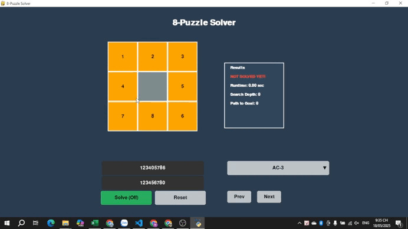          |
| Minconflicts           | 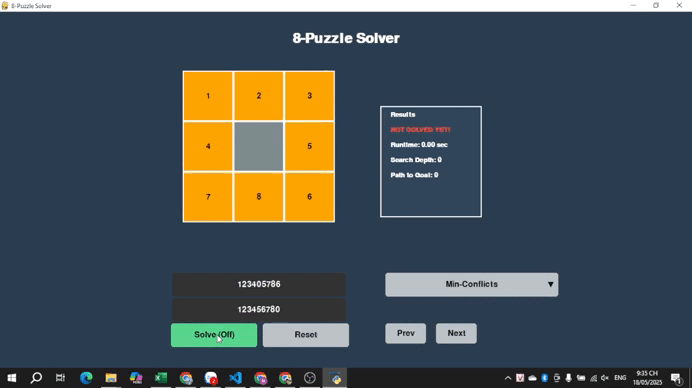 |

#### 🔹 So sánh hiệu suất:

| Thuật toán             | Nodes Expanded | Search Depth | Time (sec) |
| ---------------------- | -------------- | ------------ | ---------- |
| Backtracking           | 54             | 9            |            |
| Backtracking with AC-3 | 32             | 8            |            |
| Minconflicts           | 18             | -            |            |

#### 🔹 Nhận xét:

- **Backtracking** kiểm tra tất cả các khả năng, dễ hiểu nhưng có thể bị lặp lại và kém hiệu quả với bài toán lớn.
- **Backtracking with AC-3** giúp loại bỏ sớm các giá trị không hợp lệ → thu hẹp không gian tìm kiếm, tăng hiệu suất đáng kể.
- ** Minconflicts ** không tạo ra lời giải cụ thể nhưng kiểm tra nhanh trạng thái có thỏa ràng buộc hay không, giúp xác định đầu vào hợp lệ.
- CSP là nhóm thuật toán cực kỳ hữu ích khi cần giải quyết bài toán có nhiều ràng buộc, như lập lịch, sudoku, hoặc tạo trạng thái khởi đầu hợp lệ trong 8-puzzle.

---

## 🏁 3. Kết luận

Sau khi thực hiện đồ án, kết quả đạt được:

- Triển khai thành công nhiều thuật toán tìm kiếm khác nhau từ cơ bản đến nâng cao.
- So sánh trực quan hiệu suất các thuật toán thông qua giao diện Pygame.
- Nâng cao kỹ năng lập trình, sử dụng thư viện đồ họa và tổ chức cấu trúc dự án AI.

---

## 🔧 Cài đặt & Chạy

### Yêu cầu:

- Python 3.x
- Pygame
- Các thư viện phụ trợ khác (nếu có)

### Cài đặt:

```bash
git clone https://github.com/JesonWS54/AI_Personal.git
cd AI_Personal
python main.py
```
